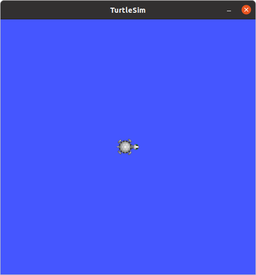
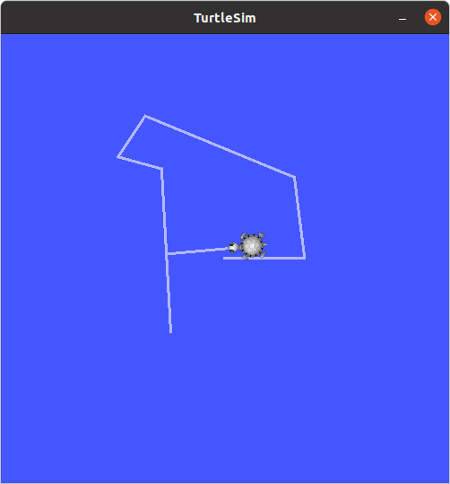

# 3.1 turtlesim 실행하고 키보드로 조작하기

이제 ROS에서 제공하는 여러 툴 중 하나인 turtlesim을 이용해 앞서 배운 기본적인 개념들을 실습해보도록 하겠습니다.

## Section 1. Getting Started with Turtlesim

**1.1 Installation**

```bash
sudo apt-get install ros-noetic-turtlesim
```

**1.2 Run**

```bash
# Terminal 1
roscore

# Terminal 2
rosrun turtlesim turtlesim_node
```
이제 귀여운 거북이 한마리와 함께 Turtlesim이 켜진 것을 확인할 수 있습니다.



## Section 2. Control a turtle with keyboard

이제 아래 명령어를 입력하면 방향키로 거북이를 움직일 수 있습니다.

```bash
rosrun turtlesim turtle_teleop_key
```



### Section 3. Review the basics

이제 간단하게 ROS CLI(Command Line Interface)를 배우며 Chapter 2에서 배운 내용을 복습해보겠습니다.

**3.1 Nodes**

우리가 처음 만든 `publisher_node`와 `subcriber_node`는 **노드**라고 부르며, ROS에서 특정 기능을 하는 실행 단위로, 다른 노드들과 통신합니다.

```bash
rosnode list
```
를 입력하면 현재 실행되고 있는 노드들의 목록이 나타납니다.

turtlesim을 모두 종료하고 이전에 만든 런치파일을 실행한 후 노드 목록을 살펴봐도 좋습니다.

**3.2 Topics**

```bash
rostopic list
```
위 명령어는 **토픽** 목록을 나타냅니다. turtlesim 노드에서 사용하는 토픽들이 나타나며 각각의 토픽들에 대한 정보는 `rostopic info`를 통해 알 수 있습니다.
혹은 ROS Wiki에 [turtlesim 패키지 설명](http://wiki.ros.org/turtlesim)이 있는 경우에는 사이트를 보는 것도 좋습니다.

별도의 터미널에서 아래 명령어를 입력한 후 키보드로 제어해보며, 메세지가 어떻게 나오는지 살펴봅니다.(터미널 4개 필요)
```bash
rostopic echo /turtle1/cmd_vel
```

위에 [문서](http://wiki.ros.org/turtlesim)에 살펴보면 **Subscribed Topics**에 `turtleX/cmd_vel(geometry_msgs/Twist)` 라고 적혀있는 것을 알 수 있습니다.

즉, 우리가 실행한 `turtle_teleop_key`는 현재 소환된 turtle1에 cmd_vel 명령어를 주고 있고 이 토픽의 타입은 [`geometry_msgs/Twist`](http://docs.ros.org/en/api/geometry_msgs/html/msg/Twist.html)입니다. Chapter 2에서 예시로 들었던 메세지 형식입니다.

추후, 키보드로 제어하는 노드를 직접 작성해볼 때 이 메세지 타입을 활용할 것입니다.

이제 `rosrun turtlesim turtle_teleop_key` 해주었던 터미널에 `Ctrl+C`를 입력하여 노드를 종료하고 아래 명령어를 입력해봅니다.

```bash
rostopic pub -1 /turtle1/cmd_vel geometry_msgs/Twist -- '[2.0, 0.0, 0.0]' '[0.0, 0.0, 1.8]'
# rostopic pub -1 <topic> <msg type> <linear x> <angular x>
```
위 명령어로도 거북이가 움직이는 것을 확인할 수 있습니다.

이는 명령어로 토픽을 publish 해준 것으로 각각 토픽 이름, 토픽 타입, 타입에 해당하는 값들임을 알 수 있습니다.

**3.3 Services**

이제 서비스(ROS Services)에 대해 알아보겠습니다.

앞서 설명한 노드 외에도, 서비스, 액션이라는 통신 방식이 있습니다. 서비스와 액션은 자주 사용하지 않기에 본 튜토리얼에서는 생략하였지만 사용하고 있는 패키지에서 제공하는 서비스는 유용하게 사용되는 경우가 있습니다.

- [Topics vs Services vs Actionlib...](https://wiki.ros.org/ROS/Patterns/Communication#Communication_via_Topics_vs_Services_vs_X)

```bash
rosservice list
```
위 turtlesim을 켜둔 상태에서 위 명령어를 입력하면 사용 가능한 서비스 목록이 나옵니다.

```bash
rosservice call /clear
```
이 명령어를 입력하면 이전에 제어하면서 생긴 거북이 발자국이 사라집니다!

이제 한마리를 더 소환해보도록 하겠습니다.
```bash
rosservice call /spawn 2 2 0.2 ""
```
2마리가 생겼습니다.

**3.4 rosparam**
```bash
rosparam --help
```
이 명령어는 ROS Parameter Server를 CLi로 사용할 수 있는 명령어를 알려줍니다.
우선 `rosparam list`로 목록을 보면 배경색 설정과 관련된 것들이 보입니다.

```bash
rosparam set /turtlesim/background_r 150
rosservice call /clear
```
배경색을 원하는대로 바꿔봅니다.

`rosparam get /turtlesim/background_r` 으로 현재 설정된 값을 확인해볼 수도 있습니다.